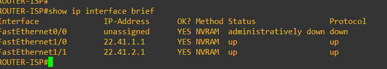
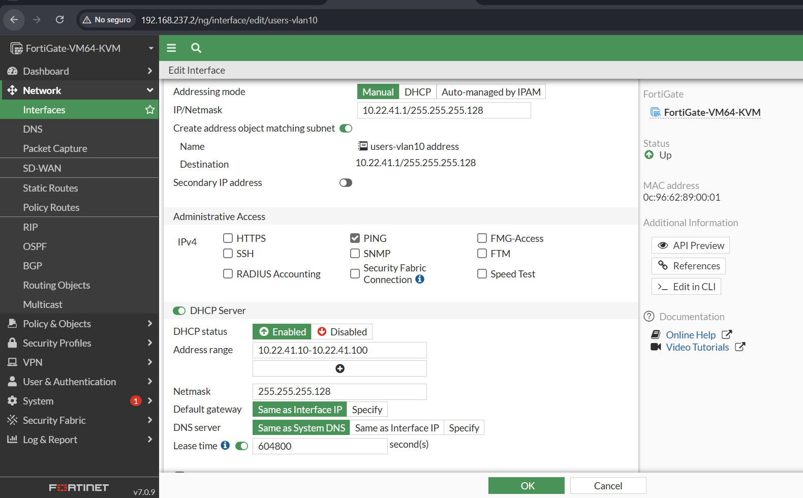
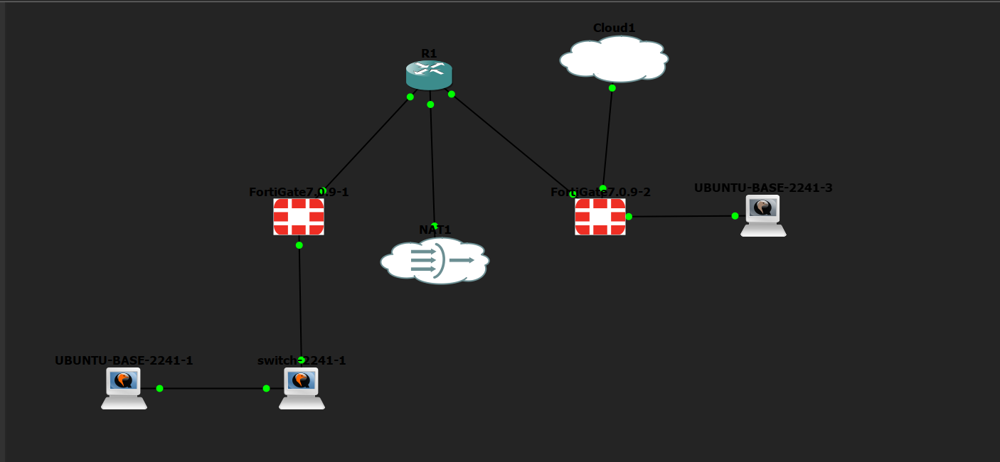
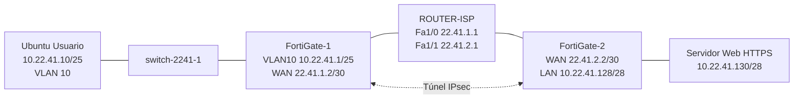

# 🔐 Infraestructura 1 — VPN Site-to-Site entre dos FortiGate

**Matrícula 20252241**


> Dos firewalls FortiGate conectados a través de un ISP (router con IPs públicas) y unidos mediante una VPN IPsec site-to-site configurada íntegramente por GUI. Un usuario (VLAN 10, DHCP) accede a un servidor web ubicado detrás del otro FortiGate, y la comunicación solo fluye mientras el túnel VPN está activo.

---

## 📺 Video de Demostración

> **[Ver demostración en YouTube →](https://youtu.be/LeJbjsIcWXk)**

---

## 📑 Tabla de Contenido

1. [Objetivo de la Red](#-objetivo-de-la-red)
2. [Cumplimiento de Requisitos](#-cumplimiento-de-requisitos)
3. [Direccionamiento IP basado en la matrícula (VLSM)](#-direccionamiento-ip-basado-en-la-matrícula-vlsm)
4. [Parámetros Usados](#-parámetros-usados)
5. [Documentación de la Red](#️-documentación-de-la-red)
6. [Funcionamiento de la Configuración](#-funcionamiento-de-la-configuración)
7. [Configuración de la VPN](#-configuración-de-la-vpn)
8. [Validación de la Implementación](#-validación-de-la-implementación)
9. [Capturas de Pantalla](#-capturas-de-pantalla)

---

## 🎯 Objetivo de la Red

Comunicar a un **Usuario** con un **Servidor Web** ubicados en sitios distintos, a través de una **VPN IPsec site-to-site** entre dos FortiGate, y comprobar que **la comunicación solo fluye si el enlace VPN está activo**.

Los dos sitios están separados por un ISP que solo conoce las redes públicas de los enlaces. Como el ISP no tiene rutas hacia las redes internas (Usuarios y Servidor), sin el túnel no existe camino entre ambos sitios. Al levantar el túnel, el tráfico viaja cifrado entre los FortiGate y el usuario puede consultar el servidor.

El direccionamiento se basó en la terminación **2241** de mi matrícula (redes `10.22.41.x` para las LAN y `22.41.x.x` para los enlaces públicos del ISP).

---

## ✅ Cumplimiento de Requisitos

| Requisito | Implementado con |
| --- | --- |
| Configuración de FortiGate por GUI | Interfaces, rutas, políticas, NAT y VPN configurados desde la interfaz web de FortiOS |
| Configuraciones de red | Interfaces WAN/LAN, subinterfaz VLAN 10 y rutas estáticas en ambos FortiGate |
| NAT | Política `lan-server-to-wan` del FortiGate-2 con NAT habilitado hacia el ISP; en las políticas de la VPN el NAT está deshabilitado para que el tráfico viaje sin traducir |
| VPN Site-to-Site entre FortiGates | Túneles IPsec `vpn-fg-1-2` (FortiGate-1) y `vpn-fg2-1` (FortiGate-2), ambos en estado *Up* |
| ISP con IPs públicas | ROUTER-ISP (Cisco c2691) con un enlace público hacia cada FortiGate (`22.41.1.1` y `22.41.2.1`) |
| Servidor Web (/28) con HTTPS | Servidor web Ubuntu con HTTPS en `10.22.41.128/28` |
| Usuarios (/25) en VLAN 10 con DHCP | Subinterfaz `VLAN10` (`10.22.41.1/25`) en FortiGate-1 con servidor DHCP |
| Traceroute hacia el servidor | Captura del traceroute desde el usuario con el túnel activo |
| Comunicación solo con VPN activa | Pruebas con el túnel arriba, abajo y restablecido |

---

## 🧮 Direccionamiento IP basado en la matrícula (VLSM)

### 1. Origen de las direcciones

Mi matrícula es **2025-2241** (`20252241`). Tomé sus **últimos cuatro dígitos, `2241`**, y los separé en dos pares, **`22`** y **`41`**, que son los que aparecen en todas las redes del laboratorio:

| Dígitos de la matrícula | Dónde se usan | Ejemplo |
| --- | --- | --- |
| `22` → segundo octeto | Redes LAN privadas (Usuarios y Servidor) | 10.**22**.41.0 |
| `41` → tercer octeto | Redes LAN privadas (Usuarios y Servidor) | 10.22.**41**.0 |
| `22.41` → dos primeros octetos | Enlaces "públicos" entre el ISP y los FortiGate | **22.41**.1.0/30 y **22.41**.2.0/30 |

### 2. Bloque base y requisitos

Con ese criterio, el bloque base de las redes internas es **`10.22.41.0/24`** (254 hosts). La tarea exige:

- Una red de **Usuarios de tipo /25**.
- Una red de **Servidor de tipo /28**.
- Enlaces con IPs públicas entre el ISP y cada FortiGate (punto a punto).

### 3. Subdivisión con VLSM

Se aplicó **VLSM (Variable Length Subnet Mask)**: se asigna primero la subred más grande y después las más pequeñas, usando un prefijo distinto para cada segmento según los hosts que necesita. Así no se desperdician direcciones y las subredes no se solapan, condición necesaria para que la VPN enrute correctamente cada red.

| # | Segmento | Prefijo | Máscara | Hosts útiles | Red | Rango utilizable | Broadcast |
| --- | --- | --- | --- | --- | --- | --- | --- |
| 1 | Usuarios (VLAN 10) | /25 | 255.255.255.128 | 126 | 10.22.41.0 | 10.22.41.1 – 10.22.41.126 | 10.22.41.127 |
| 2 | Servidor Web | /28 | 255.255.255.240 | 14 | 10.22.41.128 | 10.22.41.129 – 10.22.41.142 | 10.22.41.143 |
| 3 | Enlace ISP ↔ FortiGate-1 | /30 | 255.255.255.252 | 2 | 22.41.1.0 | 22.41.1.1 – 22.41.1.2 | 22.41.1.3 |
| 4 | Enlace ISP ↔ FortiGate-2 | /30 | 255.255.255.252 | 2 | 22.41.2.0 | 22.41.2.1 – 22.41.2.2 | 22.41.2.3 |

**Cálculo de cada prefijo:**

- **/25:** 32 − 25 = 7 bits de host → 2⁷ = 128 direcciones → 126 hosts útiles. Bloque `10.22.41.0 – 10.22.41.127`.
- **/28:** 32 − 28 = 4 bits de host → 2⁴ = 16 direcciones → 14 hosts útiles. Empieza justo donde termina la red de Usuarios: `10.22.41.128 – 10.22.41.143`.
- **/30:** 32 − 30 = 2 bits de host → 2² = 4 direcciones → 2 hosts útiles, los justos para un enlace punto a punto (ISP y FortiGate).

El resto del bloque (`10.22.41.144 – 10.22.41.255`) queda libre para crecimiento futuro.

### 4. Asignación de direcciones

| Dispositivo | Interfaz | IP | Subred |
| --- | --- | --- | --- |
| FortiGate-1 | `VLAN10` (sobre port2) | 10.22.41.1 | 10.22.41.0/25 |
| Usuario | ens3 (DHCP, rango .10 – .100) | 10.22.41.10 | 10.22.41.0/25 |
| Servidor Web | ens3 | 10.22.41.130 | 10.22.41.128/28 |
| ROUTER-ISP | FastEthernet1/0 | 22.41.1.1 | 22.41.1.0/30 |
| FortiGate-1 | `WAN-ISP` (port1) | 22.41.1.2 | 22.41.1.0/30 |
| ROUTER-ISP | FastEthernet1/1 | 22.41.2.1 | 22.41.2.0/30 |
| FortiGate-2 | `isp-wan` (port1) | 22.41.2.2 | 22.41.2.0/30 |

**Evidencia en los equipos:**

Interfaces del ROUTER-ISP con las IPs de los enlaces públicos:



Subinterfaz VLAN 10 del FortiGate-1 (`10.22.41.1/25`) y su servidor DHCP (`10.22.41.10 – 10.22.41.100`):



---

## 🧩 Parámetros Usados

| Parámetro | Valor |
| --- | --- |
| Plataforma | FortiGate-VM64-KVM, FortiOS 7.0.9 |
| Emulador | GNS3 |
| ISP | Router Cisco c2691 (`ROUTER-ISP`, nodo R1) |
| Switch | Cisco IOSvL2 (`switch-2241-1`) |
| Red de Usuarios (VLAN 10) | `10.22.41.0/25` — gateway `10.22.41.1`, DHCP `10.22.41.10 – 10.22.41.100`, lease 604800 s |
| Red del Servidor | `10.22.41.128/28` — servidor `10.22.41.130` |
| Enlace ISP ↔ FortiGate-1 | `22.41.1.0/30` — ISP `22.41.1.1` (Fa1/0), FortiGate-1 `22.41.1.2` |
| Enlace ISP ↔ FortiGate-2 | `22.41.2.0/30` — ISP `22.41.2.1` (Fa1/1), FortiGate-2 `22.41.2.2` |
| Túnel en FortiGate-1 | `vpn-fg-1-2` (interfaz `WAN-ISP`, port1), peer `22.41.2.2` |
| Túnel en FortiGate-2 | `vpn-fg2-1` (interfaz `isp-wan`, port1) |
| Creación de la VPN | IPsec Wizard, plantilla *Site to Site - FortiGate* |
| Autenticación | Clave precompartida (Pre-shared Key) |
| Dead Peer Detection | On Demand, 3 reintentos cada 20 s |

---

## 🗺️ Documentación de la Red

### Topología



### Diagrama de la VPN



### Tabla de Direccionamiento

| Dispositivo | Interfaz | IP | Rol |
| --- | --- | --- | --- |
| FortiGate-1 | `WAN-ISP` (port1) | 22.41.1.2/30 | Enlace hacia el ISP |
| FortiGate-1 | `VLAN10` (sobre port2) | 10.22.41.1/25 | Gateway de Usuarios |
| FortiGate-2 | `isp-wan` (port1) | 22.41.2.2/30 | Enlace hacia el ISP |
| FortiGate-2 | `sever-lan` (port2) | Red 10.22.41.128/28 | LAN del Servidor |
| ROUTER-ISP | FastEthernet1/0 | 22.41.1.1 | Enlace hacia FortiGate-1 |
| ROUTER-ISP | FastEthernet1/1 | 22.41.2.1 | Enlace hacia FortiGate-2 |
| Usuario | ens3 | 10.22.41.10/25 (DHCP) | Cliente de prueba |
| Servidor Web | ens3 | 10.22.41.130/28 | Servidor HTTPS |

> Los nodos NAT1 y Cloud1 de la topología solo se usaron para dar acceso a internet durante la instalación y para entrar a la GUI (port3 de cada FortiGate); no forman parte del escenario evaluado.

---

## 🔬 Funcionamiento de la Configuración

**Segmentación:** el switch entrega la VLAN 10 al usuario y la une por trunk al FortiGate-1, que termina la VLAN como subinterfaz 802.1Q sobre `port2` y le entrega direcciones por DHCP. El servidor está directamente detrás del FortiGate-2.

**ISP:** el router ROUTER-ISP solo tiene direccionamiento público en sus dos enlaces (`22.41.1.1` y `22.41.2.1`). No posee rutas hacia las redes internas, por lo que sin VPN ambos sitios son inalcanzables entre sí.

**VPN IPsec site-to-site:** cada FortiGate define el túnel con el otro como peer, usando su IP pública. Los selectores de la Fase 2 (`vpn-fg-1-2_local` / `vpn-fg-1-2_remote`) definen qué redes viajan cifradas (Usuarios ↔ Servidor). Una ruta estática en cada FortiGate envía el tráfico hacia la red remota por la interfaz del túnel.

**Políticas de firewall:** en el FortiGate-2 existen políticas en ambos sentidos entre `sever-lan` y el túnel `vpn-fg2-1` (con NAT deshabilitado) y una política de salida hacia `isp-wan` con NAT habilitado. Todo lo demás cae en el *Implicit Deny*.

**Dependencia del túnel:** al desactivar el túnel, la ruta hacia la red remota deja de ser válida y el tráfico no llega al servidor. Al restablecerlo, la comunicación se recupera.

---

## 🔧 Configuración de la VPN

> Toda la configuración se realizó desde la GUI de FortiOS (**VPN → IPsec Wizard**). Las configuraciones completas de cada equipo están en la carpeta `running-configs/`.

- **Plantilla:** Site to Site - FortiGate.
- **Peer remoto:** IP estática del otro FortiGate (`22.41.2.2` visto desde el FortiGate-1).
- **Interfaz de salida:** `port1` (enlace hacia el ISP).
- **Autenticación:** clave precompartida.
- **Fase 2:** selectores local y remoto creados por el asistente, correspondientes a las redes de Usuarios y Servidor.
- **Rutas y políticas:** generadas por el asistente hacia la red remota a través de la interfaz del túnel.

---

## ✅ Validación de la Implementación

**Prueba 1 — Usuario obtiene IP por DHCP:** `ip a` en el usuario muestra `10.22.41.10/25` asignada dinámicamente por el FortiGate-1.

**Prueba 2 — Túnel activo:** en **VPN → IPsec Tunnels** ambos túneles (`vpn-fg-1-2` y `vpn-fg2-1`) aparecen en estado *Up*.

**Prueba 3 — Comunicación con el túnel arriba:**

```
ping -c 3 10.22.41.130
traceroute 10.22.41.130
curl -k https://10.22.41.130
```

El servidor responde (ping con 0 % de pérdida) y el traceroute muestra el camino hacia el servidor.

**Prueba 4 — Túnel abajo:** se desactiva el túnel desde la GUI y se repite el ping: 100 % de pérdida.

**Prueba 5 — Túnel restablecido:** se vuelve a activar el túnel y la comunicación se recupera.

---

## 📸 Capturas de Pantalla

```
images/
├── 01-topologia.png
├── 02-show-vlan-brief.png
├── 03-show-interfaces-trunk.png
├── 04-usuario-dhcp-traceroute.png
├── 05-interfaces-fortigate1.png
├── 06-static-routes-fortigate1.png
├── 07-ping-usuarios-a-server.png
├── 08-vpn-ipsec-tunnels.png
├── 09-vpn-ipsec-tunnels-configuracion.png
├── 10-ip-a-server.png
├── 11-firewall-policy-f2.png
├── 12-network-interfaces-f2.png
├── 13-static-routes-f2.png
├── 14-ipsec-tunnels-f2.png
└── 15-firewall-policy-f1.png
```

```
running-configs/
├── ROUTER-ISP.txt
├── switch-2241-1.txt
├── FortiGate-1.conf
└── FortiGate-2.conf
```
